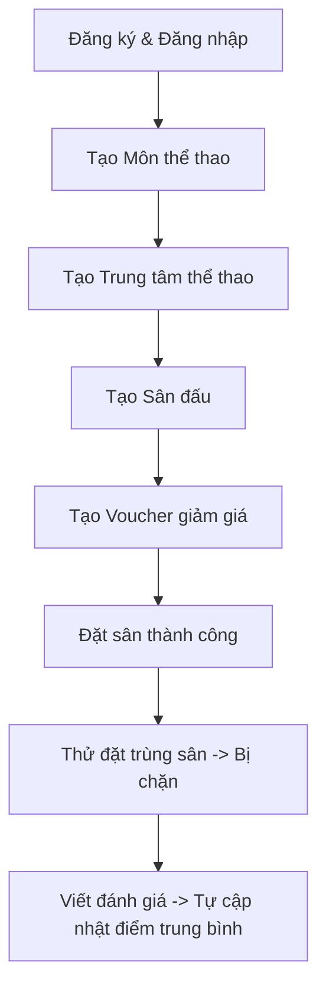

# Cẩm nang Kiểm thử toàn diện Courtify trên Postman

Chào em! Dưới đây là luồng nghiệp vụ chính (Main Flow) của Courtify được thiết kế theo đúng chuẩn thực tế. Em hãy mở Postman và thực hiện tuần tự các bước dưới đây để kiểm tra hoạt động của toàn bộ hệ thống API nhé.

---

## Tóm tắt Luồng Nghiệp vụ chính (Main Flow)



---

## Hướng dẫn từng bước chi tiết (Các Payload mẫu)

### Bước 1: Tạo Tài khoản & Đăng nhập

Đầu tiên, hệ thống cần 2 vai trò: **Chủ sân (Owner)** để đăng ký trung tâm và **Khách hàng (User)** để đặt sân.

#### 1. Đăng ký tài khoản Chủ sân (Owner)
- **Method**: `POST`
- **URL**: `http://localhost:3000/api/users/register`
- **Body** (JSON):
  ```json
  {
    "name": "Chủ Sân Đẹp Trai",
    "email": "owner@courtify.com",
    "password": "123",
    "confirm_password": "123",
    "phone": "0999888777"
  }
  ```
> [!NOTE]
> Sau khi gửi thành công, copy lấy `_id` của tài khoản này để làm `owner_id`. 
> Mặc định tài khoản tạo qua register sẽ là `user`. Em có thể cập nhật tài khoản này thành `owner` bằng API Update:
> - **Method**: `PUT`
> - **URL**: `http://localhost:3000/api/users/<owner_id>`
> - **Body**: `{ "role": "owner" }`

#### 2. Đăng ký tài khoản Khách hàng (User)
- **Method**: `POST`
- **URL**: `http://localhost:3000/api/users/register`
- **Body**:
  ```json
  {
    "name": "Khách hàng Đặt Sân",
    "email": "customer@courtify.com",
    "password": "123",
    "confirm_password": "123",
    "phone": "0911222333"
  }
  ```
> [!NOTE]
> Đăng nhập tài khoản khách hàng để nhận **Token** sử dụng cho các bước tiếp theo nếu cần:
> - **Method**: `POST`
> - **URL**: `http://localhost:3000/api/users/login`
> - **Body**: `{ "email": "customer@courtify.com", "password": "123" }`
> - Lưu lại `access_token` và `_id` của Khách hàng (`user_id`).

---

### Bước 2: Tạo Môn thể thao (Sports)
Hệ thống cần danh mục môn thể thao trước khi tạo trung tâm.

- **Method**: `POST`
- **URL**: `http://localhost:3000/api/sports`
- **Body**:
  ```json
  {
    "name": "Cầu Lông"
  }
  ```
> [!NOTE]
> Gửi xong copy lấy `_id` của môn thể thao này (`sport_id`).

---

### Bước 3: Đăng ký Trung tâm thể thao (Sports Centers)
Chủ sân đăng ký một trung tâm thể thao với môn Cầu Lông và biểu giá cụ thể.

- **Method**: `POST`
- **URL**: `http://localhost:3000/api/sports-centers`
- **Body**:
  ```json
  {
    "owner_id": "điền_owner_id_ở_bước_1",
    "sport_id": "điền_sport_id_ở_bước_2",
    "name": "Trung Tâm Cầu Lông Courtify Quận 1",
    "address": "123 Nguyễn Du, Quận 1, TP. HCM",
    "location": "10.7769, 106.6953",
    "description": "Sân cầu lông đạt chuẩn thi đấu quốc tế, dịch vụ chuyên nghiệp.",
    "pricing": [
      { "start_time": "08:00", "end_time": "09:00", "price": 100000 },
      { "start_time": "09:00", "end_time": "10:00", "price": 100000 },
      { "start_time": "17:00", "end_time": "18:00", "price": 150000 }
    ]
  }
  ```
> [!NOTE]
> Gửi xong copy lấy `_id` của trung tâm thể thao (`sport_center_id`).

---

### Bước 4: Tạo Sân đấu con (Courts)
Trong trung tâm sẽ có nhiều sân nhỏ (Ví dụ: Sân số 1, Sân số 2...).

- **Method**: `POST`
- **URL**: `http://localhost:3000/api/courts`
- **Body**:
  ```json
  {
    "sport_center_id": "điền_sport_center_id_ở_bước_3",
    "name": "Sân Số 1",
    "description": "Sân thảm PVC Yonex cao cấp",
    "status": "active"
  }
  ```
> [!NOTE]
> Gửi xong copy lấy `_id` của sân đấu này (`court_id`).

---

### Bước 5: Tạo Voucher Giảm Giá (Vouchers)
Chủ sân phát hành voucher cho người đặt sân tại trung tâm của mình.

- **Method**: `POST`
- **URL**: `http://localhost:3000/api/vouchers`
- **Body**:
  ```json
  {
    "owner_id": "điền_owner_id_ở_bước_1",
    "sport_center_id": "điền_sport_center_id_ở_bước_3",
    "code": "COURTIFY10",
    "description": "Giảm giá 10% tối đa 50k cho đơn từ 100k",
    "discount_percent": 10,
    "max_discount": 50000,
    "min_order": 100000,
    "start_date": "2026-06-01T00:00:00.000Z",
    "end_date": "2026-06-30T23:59:59.000Z",
    "usage_limit": 100
  }
  ```
> [!NOTE]
> Lưu lại `_id` của voucher này (`voucher_id`).

---

### Bước 6: Đặt sân (Bookings) - Kiểm nghiệm chức năng cốt lõi

Khách hàng thực hiện đặt sân số 1 vào ngày **15/06/2026** từ **08:00 - 09:00**.

- **Method**: `POST`
- **URL**: `http://localhost:3000/api/bookings`
- **Body**:
  ```json
  {
    "user_id": "điền_user_id_của_khách_ở_bước_1",
    "sport_center_id": "điền_sport_center_id_ở_bước_3",
    "court_id": "điền_court_id_ở_bước_4",
    "booking_date": "2026-06-15T00:00:00.000Z",
    "slots": [
      { "start_time": "08:00", "end_time": "09:00", "price": 100000 }
    ],
    "subtotal": 100000,
    "voucher_id": "điền_voucher_id_ở_bước_5",
    "voucher_code": "COURTIFY10",
    "discount_amount": 10000,
    "total_price": 90000,
    "payment_method": "cash",
    "payment_status": "unpaid",
    "booking_status": "pending",
    "note": "Đặt sân đá giao hữu"
  }
  ```
> [!NOTE]
> Gửi thành công bạn sẽ nhận được thông tin booking cùng mã `booking_code` tự động sinh (ví dụ: `BK16867623...`). Copy lấy `_id` của booking này (`booking_id`).

---

### Bước 7: Kiểm thử chặn đặt trùng sân (Double Booking Prevention)

**Hành động**: Hãy giữ nguyên Body của Bước 6, và bấm nút **Send** lại một lần nữa (hoặc thay đổi user_id của khách hàng khác rồi bấm gửi).

* **Kết quả mong đợi**: Hệ thống phải chặn ngay lập tức và trả về mã lỗi `400` kèm thông báo:
  ```json
  {
    "message": "Khung giờ này vừa mới được người khác đặt, vui lòng chọn khung giờ khác",
    "error": "..."
  }
  ```
  *(Đây chính là tác dụng của Unique Index mà chúng ta đã cấu hình thành công trên Database)*.

---

### Bước 8: Viết đánh giá & Tự tính điểm trung bình (Reviews)

Khách hàng sau khi chơi xong, viết đánh giá 5 sao cho sân đấu.

- **Method**: `POST`
- **URL**: `http://localhost:3000/api/reviews`
- **Body**:
  ```json
  {
    "booking_id": "điền_booking_id_ở_bước_6",
    "user_id": "điền_user_id_khách_ở_bước_1",
    "sport_center_id": "điền_sport_center_id_ở_bước_3",
    "court_id": "điền_court_id_ở_bước_4",
    "rating": 5,
    "comment": "Sân siêu đẹp, thảm êm, giá cả hợp lý!"
  }
  ```

#### Kiểm chứng tính tự động:
Sau khi gửi Review thành công, em hãy gọi lại API lấy chi tiết Sân đấu hoặc lấy chi tiết Trung tâm:
* **GET** `http://localhost:3000/api/courts/điền_court_id`
* **GET** `http://localhost:3000/api/sports-centers/điền_sport_center_id`
* **Kết quả**: Trường `rating_avg` sẽ chuyển thành `5` và `review_count` sẽ tăng lên `1` tự động!
